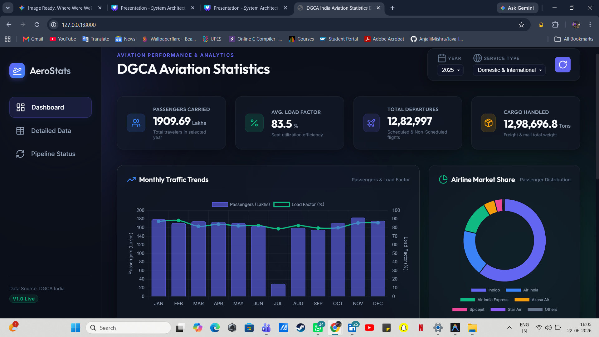
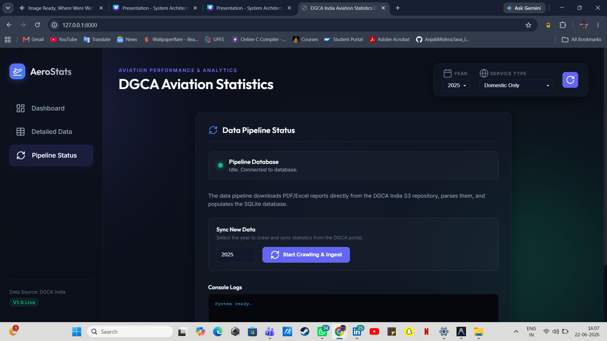

# ✈️ DGCA Aviation Statistics Dashboard

Designed and developed an automated aviation analytics platform that retrieves DGCA monthly traffic reports, processes PDF-based datasets, performs data cleaning and normalization, stores records in SQLite, serves data through FastAPI endpoints, and delivers actionable insights through an interactive dashboard featuring KPI monitoring, trend analysis, airline performance metrics, and traffic analytics.

## 🚀 Features

- Automated DGCA PDF scraping
- PDF data extraction and preprocessing using Pandas
- SQLite database integration
- FastAPI backend APIs
- Interactive dashboard
- Aviation traffic analytics
- Airline performance insights

## 🛠️ Tech Stack
- Python
- FastAPI
- SQLite
- Pandas
- Plotly
- JavaScript
- HTML/CSS
- pdfplumber


## Project Workflow

1. Scraper downloads DGCA reports from the DGCA portal.
2. Parser extracts aviation statistics from PDF files.
3. Data is cleaned and normalized using Pandas.
4. Processed records are stored in SQLite.
5. FastAPI exposes analytics APIs.
6. Dashboard visualizes KPIs, airline performance, and traffic trends.


## 👩‍💻 Author

Anjali Mishra

B.Tech Data Science | UPES Dehradun


## 🏗️ System Architecture
```text
DGCA Website
     │
     ▼
Scraper Module
(scraper.py)
     │
     ▼
Parser Module
(parser.py)
     │
     ▼
Data Cleaning &
Transformation
     │
     ▼
SQLite Database
(db.py)
     │
     ▼
FastAPI Backend
(api.py)
     │
     ▼
Dashboard UI
(index.html, app.js)
```

## 📊 Dashboard Preview
Interactive dashboard built using FastAPI, SQLite, Plotly, and JavaScript.
### Main Dashboard



### Detailed Data Page


### Pipeline Status


